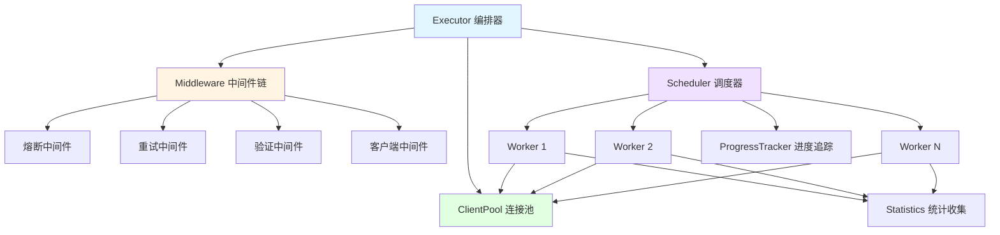

# go-stress

[](https://github.com/kamalyes/go-stress)
[](https://godoc.org/github.com/kamalyes/go-stress)
[](https://github.com/kamalyes/go-stress/blob/main/LICENSE)

一个功能强大、架构优雅的 Go 语言压测工具，采用分层架构和中间件模式，支持 HTTP/gRPC 协议，提供熔断、重试、连接池等企业级特性

## 📖 核心特性

| 特性 | 说明 |
|:-----|:-----|
| 🔧 **curl 命令解析** | 自动识别 Unix/Windows curl 命令风格，快速生成配置 |
| 🏗️ **分层架构** | Executor、Scheduler、Worker 分层设计，职责清晰 |
| 🔌 **中间件模式** | 可插拔的中间件链：熔断、重试、验证 |
| 🏊 **连接池管理** | 智能连接复用，减少70%内存占用 |
| ⚡ **高性能** | 支持高并发压测，智能调度和资源管理 |
| 🛡️ **熔断保护** | 防止服务雪崩，智能流量控制 |
| 🔄 **自动重试** | 可配置的重试策略，提高成功率 |
| ✅ **响应验证** | 支持状态码、JSON、正则等多种验证方式 |
| 📊 **实时统计** | 详细的性能报告：QPS、延迟、成功率 |
| 🌐 **多协议支持** | HTTP、gRPC、WebSocket（规划中） |
| 📈 **渐进启动** | Ramp-up 模式，平滑增加负载 |
| 📊 **进度跟踪** | 实时显示进度和预估完成时间 |
| 🎯 **类型安全** | 泛型设计，编译时类型检查 |
| 🌍 **跨平台** | 支持 macOS、Linux、Windows |
| 💾 **双存储模式** | 内存模式（高速）/ SQLite 模式（持久化） |
| 🔍 **内存监控** | 自动监控内存使用，超过阈值自动停止 |
| 🔤 **变量系统** | 支持环境变量、随机值、加密函数等动态变量 |
| 🌐 **实时报告** | 实时 Web 报告服务器，支持图表和日志查看 |
| 📊 **HTML 报告** | 生成静态 HTML 报告，支持离线查看 |
| 🗂️ **报告管理** | 自动清理旧报告，保留最近 N 个 |

> 📖 **架构设计**：查看 [架构文档](docs/ARCHITECTURE.md) 了解详细的设计思路

## 🏗️ 架构概览



### 核心概念

- **Executor（编排器）**：负责组装和协调所有组件，生成最终报告
- **Scheduler（调度器）**：管理 Worker 生命周期，实现并发控制和渐进启动
- **Worker（工作单元）**：执行具体的压测请求，维护单个并发单元的状态
- **Middleware（中间件）**：以责任链模式处理请求：熔断 → 重试 → 验证 → 发送
- **ClientPool（连接池）**：复用客户端连接，优化资源使用
- **ProgressTracker（进度追踪）**：实时显示进度、速率和预估时间

## 📦 安装

```bash
go get github.com/kamalyes/go-stress
```

## 📋 命令行参数

### 基础参数

| 参数 | 类型 | 默认值 | 说明 |
|:-----|:-----|:------|:-----|
| `-config` | string | - | 配置文件路径（yaml/json） |
| `-curl` | string | - | curl 命令文件路径 |
| `-protocol` | string | http | 协议类型（http/grpc/websocket） |
| `-c` | uint64 | 1 | 并发数 |
| `-n` | uint64 | 1 | 每个并发的请求数 |
| `-url` | string | - | 目标 URL |
| `-method` | string | GET | 请求方法 |
| `-timeout` | duration | 30s | 请求超时时间 |

### HTTP 参数

| 参数 | 类型 | 默认值 | 说明 |
|:-----|:-----|:------|:-----|
| `-http2` | bool | false | 使用 HTTP/2 |
| `-keepalive` | bool | false | 使用长连接 |
| `-data` | string | - | 请求体数据 |
| `-H` | array | - | 请求头（可多次使用） |

### gRPC 参数

| 参数 | 类型 | 默认值 | 说明 |
|:-----|:-----|:------|:-----|
| `-grpc-reflection` | bool | false | 使用 gRPC 反射 |
| `-grpc-service` | string | - | gRPC 服务名 |
| `-grpc-method` | string | - | gRPC 方法名 |

### 日志配置

| 参数 | 类型 | 默认值 | 说明 |
|:-----|:-----|:------|:-----|
| `-log-level` | string | info | 日志级别（debug/info/warn/error） |
| `-log-file` | string | - | 日志文件路径 |
| `-quiet` | bool | false | 静默模式（仅错误） |
| `-verbose` | bool | false | 详细模式（包含调试信息） |

### 报告配置

| 参数 | 类型 | 默认值 | 说明 |
|:-----|:-----|:------|:-----|
| `-report-prefix` | string | stress-report | 报告文件名前缀 |
| `-storage` | string | memory | 存储模式（memory/sqlite） |

### 性能和监控

| 参数 | 类型 | 默认值 | 说明 |
|:-----|:-----|:------|:-----|
| `-max-memory` | string | - | 内存使用阈值（如：1GB, 512MB, 2048KB） |

### 使用示例

```bash
# 完整参数示例
go-stress \
  -url https://api.example.com/users \
  -method POST \
  -c 100 \
  -n 1000 \
  -timeout 10s \
  -H "Content-Type: application/json" \
  -H "Authorization: Bearer token" \
  -data '{"name":"test"}' \
  -storage sqlite \
  -report-prefix my-test \
  -max-memory 1GB \
  -log-level debug \
  -verbose
```

## 🚀 快速开始

### 方式一：命令行模式（最简单）

```bash
# 简单 HTTP GET 压测
go-stress -url https://example.com -c 10 -n 100

# POST 请求
go-stress -url https://api.example.com/users \
  -method POST \
  -data '{"name":"test"}' \
  -H "Content-Type: application/json" \
  -c 10 -n 100

# 使用 SQLite 持久化存储
go-stress -url https://api.example.com \
  -c 100 -n 1000 \
  -storage sqlite \
  -report-prefix my-test

# 启用内存监控（超过阈值自动停止）
go-stress -url https://api.example.com \
  -c 100 -n 10000 \
  -max-memory 1GB

# gRPC 压测
go-stress -protocol grpc \
  -url localhost:50051 \
  -grpc-reflection \
  -grpc-service myservice \
  -grpc-method MyMethod \
  -c 5 -n 50
```

### 方式二：从 curl 命令/文件快速开始

```bash
# 从 curl 文件加载
go-stress -curl requests.txt -c 10 -n 100

# curl 文件内容示例 (requests.txt):
curl 'http://localhost:8080/api/users' \
  -H 'Content-Type: application/json' \
  -H 'Authorization: Bearer token123' \
  --data-raw '{"name":"test"}' \
  --insecure
```

**代码方式：**

```go
package main

import (
    "context"
    "github.com/kamalyes/go-stress/config"
    "github.com/kamalyes/go-stress/executor"
)

func main() {
    // 从 curl 命令解析配置（自动识别 Unix/Windows 风格）
    curlCmd := `curl 'http://localhost:8080/api/users' \
      -H 'Content-Type: application/json' \
      -H 'Authorization: Bearer token123' \
      --data-raw '{"name":"test"}' \
      --insecure`
    
    cfg, _ := config.ParseCurlCommand(curlCmd)
    cfg.Concurrency = 100
    cfg.Requests = 1000
    
    exec, _ := executor.NewExecutorWithMemoryStorage(cfg)
    report, _ := exec.Run(context.Background())
    report.Print()
}
```

### 方式三：配置文件模式（推荐）

```bash
# 使用配置文件
go-stress -config config.yaml
```

**配置文件示例 (config.yaml)：**

```yaml
protocol: http
url: https://api.example.com/users
method: POST
concurrency: 10
requests: 100
timeout: 30s

headers:
  Content-Type: application/json
  X-Request-ID: "{{randomUUID}}"
  Authorization: "Bearer {{env \"API_TOKEN\"}}"

body: |
  {
    "id": {{seq}},
    "username": "user_{{randomString 8}}",
    "email": "{{randomEmail}}",
    "timestamp": {{timestamp}},
    "token": "{{base64 (randomString 16)}}"
  }

# 高级配置
advanced:
  enable_breaker: true
  max_failures: 10
  reset_timeout: 30s
  enable_retry: true
  max_retries: 3
  ramp_up: 10s

# 存储模式（memory 或 sqlite）
storage: memory

# 响应验证
verify:
  type: status_code
  rules:
    expected: 200
```

### 方式四：代码集成

```go
package main

import (
    "context"
    "time"
    
    "github.com/kamalyes/go-stress/config"
    "github.com/kamalyes/go-stress/executor"
    "github.com/kamalyes/go-stress/types"
)

func main() {
    cfg := &config.Config{
        Protocol:    types.ProtocolHTTP,
        URL:         "http://localhost:8080/api",
        Method:      "GET",
        Concurrency: 100,
        Requests:    1000,
        Timeout:     10 * time.Second,
    }
    
    // 选择存储模式
    // 方式1: 内存模式（高速、不持久化）
    exec, _ := executor.NewExecutorWithMemoryStorage(cfg)
    
    // 方式2: SQLite 模式（持久化、可查询）
    // exec, _ := executor.NewExecutorWithSQLiteStorage(cfg, "./report.db")
    
    report, _ := exec.Run(context.Background())
    report.Print()
}
```

## 🏗️ 高级特性

### 📊 存储模式

支持两种存储模式：

| 模式 | 特点 | 适用场景 |
|:-----|:-----|:--------|
| **memory** | 高速、无限制、不持久化 | 快速测试、临时验证 |
| **sqlite** | 持久化、无限制、可查询 | 详细分析、历史记录 |

```bash
# 内存模式（默认）
go-stress -url https://api.example.com -c 10 -n 100 -storage memory

# SQLite 模式
go-stress -url https://api.example.com -c 10 -n 100 -storage sqlite
```

SQLite 模式会生成 `details.db` 文件，可使用 SQL 工具查询详细数据。

### 🔍 内存监控

自动监控内存使用，超过阈值自动停止测试：

```bash
# 设置内存阈值为 1GB
go-stress -url https://api.example.com -c 100 -n 10000 -max-memory 1GB

# 支持单位：KB, MB, GB
go-stress -url https://api.example.com -max-memory 512MB
```

**内存监控特性：**

- **三级告警**：80% 警告 → 100% 严重（自动停止）
- **增长率监控**：30秒内增长超过 20% 告警
- **实时指标**：Alloc、Sys、Goroutines、GC 次数
- **自动保护**：达到阈值自动停止，防止 OOM

### 🔧 变量系统

支持在 URL、请求体、请求头中使用动态变量：

#### 环境变量

```yaml
headers:
  Authorization: "Bearer {{env \"API_TOKEN\"}}"
  X-User-ID: "{{env \"USER_ID\"}}"
```

#### 序列号和时间

```yaml
url: "https://api.example.com/user/{{seq}}"  # 自增序列号
body: |
  {
    "id": {{seq}},
    "timestamp": {{timestamp}},     # Unix 毫秒时间戳
    "unix": {{unix}},              # Unix 秒时间戳
    "nano": {{unixNano}}           # Unix 纳秒时间戳
  }
```

#### 随机函数

```yaml
body: |
  {
    "username": "user_{{randomString 8}}",        # 随机字符串
    "age": {{randomInt 18 60}},                   # 随机整数
    "score": {{randomFloat 0.0 100.0}},           # 随机浮点数
    "uuid": "{{randomUUID}}",                     # UUID
    "email": "{{randomEmail}}",                   # 随机邮箱
    "phone": "{{randomPhone}}",                   # 随机手机号
    "ip": "{{randomIP}}"                          # 随机 IP
  }
```

#### 加密和编码

```yaml
headers:
  X-Request-ID: "{{randomUUID}}"
  X-Signature: "{{md5 \"secret\"}}"              # MD5
  X-Hash: "{{sha1 \"data\"}}"                    # SHA1
  Authorization: "Basic {{base64 \"user:pass\"}}" # Base64
  X-Token: "{{urlEncode \"a b c\"}}"             # URL 编码
```

#### 系统信息

```yaml
headers:
  X-Hostname: "{{hostname}}"      # 主机名
  X-Client-IP: "{{localIP}}"      # 本机 IP
```

**命令行使用示例：**

```bash
# URL 中使用变量
go-stress -url 'https://api.example.com/user/{{seq}}' -c 10 -n 100

# 请求体中使用变量
go-stress -url https://api.example.com/users \
  -method POST \
  -data '{"id": {{seq}}, "name": "user_{{randomString 8}}"}' \
  -c 10 -n 100

# 请求头中使用变量
go-stress -url https://api.example.com \
  -H "X-Request-ID: {{randomUUID}}" \
  -H "X-Timestamp: {{timestamp}}" \
  -c 10 -n 100
```

### 📊 实时报告

压测时自动启动实时报告服务器：

```bash
go-stress -url https://api.example.com -c 10 -n 100

# 自动输出：
# 🌐 实时报告: http://localhost:8088
# 访问浏览器查看实时统计数据
```

**实时报告特性：**

- **实时更新**：QPS、延迟、成功率实时刷新
- **图表展示**：响应时间分布、吞吐量趋势
- **详细日志**：每个请求的详细信息
- **自动刷新**：无需手动刷新页面

测试完成后会生成静态 HTML 报告：

```
stress-report/1234567890/
├── index.html       # 静态报告（可离线查看）
├── index.json       # 原始数据（JSON 格式）
├── details.db       # SQLite 数据库（如果使用 sqlite 模式）
└── report_*.js      # 报告资源文件
```

### curl 命令解析

自动识别并解析两种风格的 curl 命令：

**Unix/Bash 风格**（使用 `\` 续行符和单引号）：

```bash
curl 'http://api.example.com/users' \
  -H 'Content-Type: application/json' \
  -H 'Authorization: Bearer token' \
  --data-raw '{"name":"test"}' \
  --insecure
```

**Windows CMD 风格**（使用 `^` 转义符和双引号）：

```cmd
curl ^"http://api.example.com/users^" ^
  -H ^"Content-Type: application/json^" ^
  -H ^"Authorization: Bearer token^" ^
  --data-raw ^"^{^\^"name^\^":^\^"test^\^"^}^" ^
  --insecure
```

程序会自动检测风格（通过统计 `^` 和 `\` 的出现频率）并应用相应的解析策略

### 中间件配置

```go
cfg := &config.Config{
    // ... 基本配置
    
    // 启用熔断
    Advanced: &config.AdvancedConfig{
        EnableBreaker: true,
        MaxFailures:   10,
        ResetTimeout:  30 * time.Second,
        
        EnableRetry: true,     // 启用重试
        RampUp:      10 * time.Second, // 渐进启动
    },
    
    // 响应验证
    Verify: &config.VerifyConfig{
        Type: string(types.VerifyStatusCode),
        Rules: map[string]interface{}{
            "expected": 200,
        },
    },
}
```

### 中间件扩展

```go
// 自定义中间件
func CustomMiddleware() executor.Middleware {
    return func(next executor.RequestHandler) executor.RequestHandler {
        return func(ctx context.Context, req *types.Request) (*types.Response, error) {
            // 前置处理
            resp, err := next(ctx, req)
            // 后置处理
            return resp, err
        }
    }
}

// 使用中间件链
chain := executor.NewMiddlewareChain()
chain.Use(CustomMiddleware())
chain.Use(executor.BreakerMiddleware(circuit))
```

## 🧪 测试

```bash
go test ./... -v                    # 运行所有测试
go test ./... -cover                # 测试覆盖率
go test -v -run TestExecutor        # 运行特定测试
```

### GitHub Actions 自动构建

项目已配置 GitHub Actions 自动化工作流：

**CI/CD Pipeline** (`.github/workflows/pipeline.yml`)

- 在 `push` 到 `develop` 分支时触发
- 支持手动触发 (`workflow_dispatch`)，可选择部署环境和是否进行代码质量检查
- **代码质量检查**：
  - 运行单元测试和集成测试
  - golangci-lint 代码质量扫描
- **多平台构建**：
  - 并行构建 6 个平台的二进制文件：
    - Windows (amd64/arm64)
    - Linux (amd64/arm64)
    - macOS (amd64/arm64)
  - 支持 UPX 压缩优化
  - 自动上传构建产物到 GitHub Artifacts

**使用方法：**

```bash
# 1. 推送到 develop 分支自动触发构建
git push origin develop

# 2. 手动触发构建（可选择环境和选项）
# 在 GitHub Actions 页面选择 "CI/CD Pipeline" workflow
# 点击 "Run workflow" 按钮，选择：
#    - 部署环境: dev/test/uat/prod
#    - 是否进行代码质量检查

# 3. 查看构建产物
# 在 Actions 运行页面下载对应平台的二进制文件
# 产物格式：binary-name-os-arch (如: go-stress-linux-amd64)
```

**配置说明：**

在 GitHub 仓库的 Settings → Secrets and variables → Actions 中配置：

- `GIT_SSH_PRIVATE_KEY`: 用于访问私有 Go 模块的 SSH 私钥

## 📚 相关资源

- 📖 [架构设计文档](docs/ARCHITECTURE.md) - 详细的架构设计和组件说明
- 🐛 [问题反馈](https://github.com/kamalyes/go-stress/issues) - 报告 bug 或提出建议
- 💬 [讨论区](https://github.com/kamalyes/go-stress/discussions) - 技术交流

## 📦 依赖

- [go-toolbox](https://github.com/kamalyes/go-toolbox) - 熔断器、重试器等工具
- [go-logger](https://github.com/kamalyes/go-logger) - 结构化日志

## 🤝 贡献

1. Fork 本仓库
2. 创建特性分支 (`git checkout -b feature/amazing-feature`)
3. 提交更改 (`git commit -m '✨ feat: Add amazing feature'`)
4. 推送到分支 (`git push origin feature/amazing-feature`)
5. 开启 Pull Request

## 📋 Git Commit Emoji 规范

<details>
<summary>点击展开 Emoji 规范表</summary>

| Emoji | 类型 | 说明 |
|:-----:|------|------|
| ✨ | feat | 新功能 |
| 🐛 | fix | 修复 bug |
| 📝 | docs | 文档更新 |
| ♻️ | refactor | 代码重构 |
| ⚡ | perf | 性能优化 |
| ✅ | test | 测试相关 |
| 🔧 | chore | 配置/构建 |
| 🚀 | deploy | 部署发布 |
| 🔒 | security | 安全修复 |
| 🔥 | remove | 删除代码 |

**示例：** `git commit -m "✨ feat(executor): 新增中间件链支持"`

</details>

## 📄 许可证

MIT License - 详见 [LICENSE](LICENSE)

## 👨‍💻 作者

Kamal Yang ([@kamalyes](https://github.com/kamalyes))
