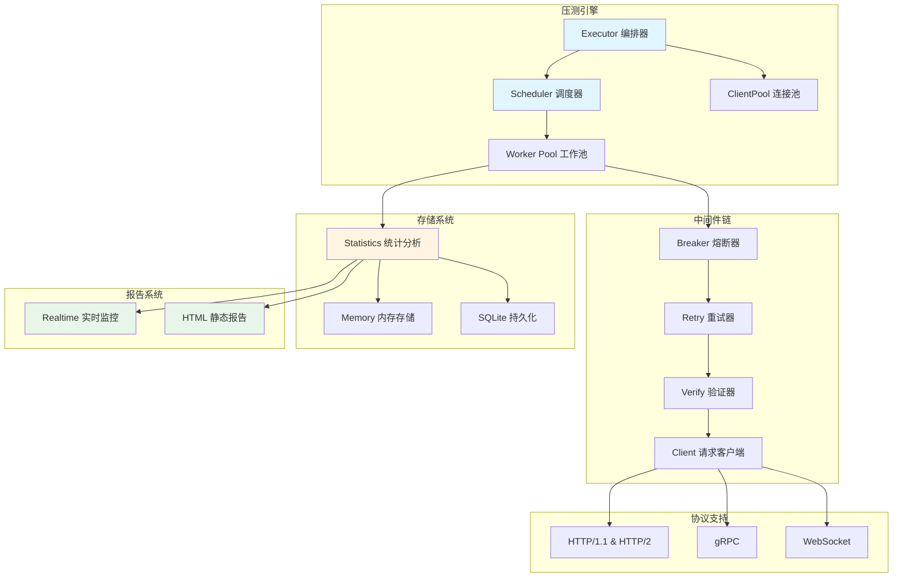

# go-stress

[](https://github.com/kamalyes/go-stress)
[](https://godoc.org/github.com/kamalyes/go-stress)
[](https://github.com/kamalyes/go-stress/blob/main/LICENSE)

⚡ 一个功能强大的 Go 语言压测工具，支持 HTTP/gRPC/WebSocket 协议，提供分布式压测、实时监控、60+ 参数化变量等高级特性

## 🏗️ 架构设计



## ✨ 核心特性

| 特性 | 说明 | 文档 |
|:-----|:-----|:-----|
| 🚀 **多协议支持** | HTTP/1.1, HTTP/2, gRPC, WebSocket | [→ 配置文档](docs/CONFIG_FILE.md) |
| 🔄 **变量系统** | 60+ 内置函数：随机值、时间戳、加密、字符串处理等 | [→ 变量函数](docs/VARIABLES.md) |
| 🌐 **分布式压测** | Master/Slave 架构支持大规模分布式场景 | [→ 分布式模式](docs/DISTRIBUTED_MODE.md) |
| 📊 **实时监控** | Web 实时监控 + HTML 静态报告 | [→ 报告文档](docs/STORAGE_REPORT.md) |
| 🔧 **灵活配置** | 命令行、YAML/JSON、curl 文件多种配置方式 | [→ CLI 参考](docs/CLI_REFERENCE.md) · [→ 快速开始](docs/GETTING_STARTED.md) |
| 🔌 **中间件架构** | 熔断、重试、验证等可插拔中间件 | [→ 配置文档](docs/CONFIG_FILE.md#中间件配置) |
| 💾 **双存储模式** | 内存模式(高速) / SQLite(持久化) | [→ 存储模式](docs/STORAGE_REPORT.md) |
| 📈 **渐进启动** | Ramp-up 模式平滑增加负载 | [→ 高级配置](docs/CONFIG_FILE.md#高级配置) |

## 📦 快速开始

```bash
# 安装
git clone https://github.com/kamalyes/go-stress.git
cd go-stress
go build -o go-stress .

# 简单压测
./go-stress -url https://api.example.com -c 10 -n 100

# 查看帮助
./go-stress help                # 完整帮助
./go-stress variables           # 查看所有变量函数
./go-stress examples            # 查看详细示例
```

**📖 [完整入门教程 →](docs/GETTING_STARTED.md)**

## 🎯 亮点功能展示

### 💡 参数化请求 - 60+ 变量函数

```bash
# 每个请求自动生成唯一数据
./go-stress -url https://api.example.com/users \
  -method POST \
  -H "Content-Type: application/json" \
  -H "X-Request-ID: {{randomUUID}}" \
  -data '{
    "id": {{seq}},
    "email": "{{randomEmail}}",
    "phone": "{{randomPhone}}",
    "timestamp": {{unix}},
    "token": "{{md5 (print (seq) (timestamp))}}"
  }' \
  -c 100 -n 10000
```

**💡 提示：** 运行 `./go-stress variables` 查看所有可用函数

### 🌐 分布式压测 - 轻松扩展到多台机器

```bash
# 1. 启动 Master 节点 - 协调和收集结果
./go-stress -mode master -grpc-port 9090 -http-port 8080

# 2. 启动 Slave 节点 - 在不同机器/区域运行
# 北京机房
./go-stress -mode slave -master master-ip:9090 -region beijing -slave-id slave-bj-1

# 上海机房
./go-stress -mode slave -master master-ip:9090 -region shanghai -slave-id slave-sh-1


# 广州机房（192.168.1.103）
./go-stress -mode slave -master master-ip:9090 -region guangzhou -slave-id slave-gz-1

# 3. 访问管理界面创建和启动任务
# http://master-ip:8080
#   - 创建任务（上传配置文件或粘贴 JSON）
#   - 点击"启动任务"按钮
#   - 选择要使用的 Slave 节点或区域
#   - 查看实时执行情况和详细数据
```

**工作流程**：

1. **创建任务** - 提交配置，任务状态为"待执行"
2. **启动任务** - 手动启动，可选择特定 Slave 或区域
3. **执行压测** - 所有选定的 Slave 并行执行
4. **查看结果** - 实时监控和详情数据查询

**📖 [分布式压测完整指南 →](docs/DISTRIBUTED_MODE.md)**

### 📊 实时监控 - 压测过程可视化

```bash
./go-stress -config config.yaml
# 自动打开浏览器 http://localhost:8088 查看实时数据
# 测试完成后生成 HTML 报告
```

### 🔧 配置文件 - 复杂场景轻松管理

```yaml
protocol: http
url: https://api.example.com/users
method: POST
concurrency: 100
requests: 50000
timeout: 10s

headers:
  Content-Type: application/json
  Authorization: "Bearer {{env \"API_TOKEN\"}}"
  X-Trace-ID: "{{md5 (print (seq) (timestamp))}}"

body: |
  {
    "id": {{seq}},
    "username": "user_{{randomString 8}}",
    "email": "{{randomEmail}}",
    "age": {{randomInt 18 65}},
    "created_at": "{{date \"2006-01-02 15:04:05\"}}"
  }

advanced:
  enable_breaker: true      # 熔断保护
  enable_retry: true        # 失败重试
  ramp_up: 30s             # 30秒内平滑启动
  
storage:
  mode: sqlite             # 持久化存储
  
realtime:
  enabled: true
  port: 8088
```

### 🌐 WebSocket 压测

```bash
# 命令行方式
./go-stress -protocol websocket \
  -url ws://localhost:8080/ws \
  -body '{"action":"ping","data":"test"}' \
  -c 50 -n 1000

# 配置文件方式
# config.yaml:
protocol: websocket
url: ws://localhost:8080/ws
body: |
  {
    "message_id": {{seq}},
    "action": "chat",
    "user_id": {{randomInt 1000 9999}},
    "content": "Message {{seq}}"
  }
concurrency: 50
requests: 1000
```

**📖 [配置文件完整说明 →](docs/CONFIG_FILE.md)**

## 🤝 贡献

欢迎提交 Issue 和 Pull Request！

1. Fork 本仓库
2. 创建特性分支 (`git checkout -b feature/amazing-feature`)
3. 提交更改 (`git commit -m '✨ feat: Add amazing feature'`)
4. 推送到分支 (`git push origin feature/amazing-feature`)
5. 开启 Pull Request

## 📋 Git Commit Emoji 规范

<details>
<summary>点击展开 Emoji 规范表</summary>

| Emoji | 类型 | 说明 |
|:-----:|------|------|
| ✨ | feat | 新功能 |
| 🐛 | fix | 修复 bug |
| 📝 | docs | 文档更新 |
| ♻️ | refactor | 代码重构 |
| ⚡ | perf | 性能优化 |
| ✅ | test | 测试相关 |
| 🔧 | chore | 配置/构建 |
| 🚀 | deploy | 部署发布 |
| 🔒 | security | 安全修复 |
| 🔥 | remove | 删除代码 |
**示例：** `git commit -m "✨ feat(executor): 新增中间件链支持"`

</details>

## 📄 许可证

[MIT License](LICENSE)
