# go-stress

[](https://github.com/kamalyes/go-stress)
[](https://godoc.org/github.com/kamalyes/go-stress)
[](https://github.com/kamalyes/go-stress/blob/main/LICENSE)

⚡ 一个功能强大的 Go 语言压测工具，支持 HTTP/gRPC/WebSocket 协议，提供分布式压测、实时监控、60+ 参数化变量等高级特性

## 🏗️ 架构设计

```mermaid
graph TB
    subgraph "压测引擎"
        Executor[Executor 编排器]
        Scheduler[Scheduler 调度器]
        WorkerPool[Worker Pool 工作池]
        ClientPool[ClientPool 连接池]
    end
    
    subgraph "中间件链"
        Breaker[Breaker 熔断器]
        Retry[Retry 重试器]
        Verify[Verify 验证器]
        Client[Client 请求客户端]
    end
    
    subgraph "协议支持"
        HTTP[HTTP/1.1 & HTTP/2]
        GRPC[gRPC]
        WebSocket[WebSocket]
    end
    
    subgraph "存储系统"
        Memory[Memory 内存存储]
        SQLite[SQLite 持久化]
        Statistics[Statistics 统计分析]
    end
    
    subgraph "报告系统"
        Realtime[Realtime 实时监控]
        HTMLReport[HTML 静态报告]
    end
    
    Executor --> Scheduler
    Executor --> ClientPool
    Scheduler --> WorkerPool
    WorkerPool --> Breaker
    
    Breaker --> Retry
    Retry --> Verify
    Verify --> Client
    
    Client --> HTTP
    Client --> GRPC
    Client --> WebSocket
    
    WorkerPool --> Statistics
    Statistics --> Memory
    Statistics --> SQLite
    
    Statistics --> Realtime
    Statistics --> HTMLReport
    
    style Executor fill:#e1f5ff
    style Scheduler fill:#e1f5ff
    style Statistics fill:#fff4e1
    style Realtime fill:#e8f5e9
    style HTMLReport fill:#e8f5e9
```



## ✨ 核心特性

| 特性 | 说明 | 文档 |
|:-----|:-----|:-----|
| 🚀 **多协议支持** | HTTP/1.1, HTTP/2, gRPC, WebSocket | [→ 配置文档](docs/CONFIG_FILE.md) |
| 🔄 **变量系统** | 60+ 内置函数：随机值、时间戳、加密、字符串处理等 | [→ 变量函数](docs/VARIABLES.md) |
| 🌐 **分布式压测** | Master/Slave 架构，支持区域选择、节点过滤、任务重试 | [→ 分布式模式](docs/DISTRIBUTED_MODE.md) |
| 📊 **实时监控** | Web 实时监控 + 跨节点数据查询 + HTML 静态报告 | [→ 报告文档](docs/STORAGE_REPORT.md) |
| 🔧 **灵活配置** | 命令行、YAML/JSON、curl 文件多种配置方式 | [→ CLI 参考](docs/CLI_REFERENCE.md) · [→ 快速开始](docs/GETTING_STARTED.md) |
| 🔌 **中间件架构** | 熔断、重试、验证等可插拔中间件 | [→ 配置文档](docs/CONFIG_FILE.md#中间件配置) |
| 💾 **双存储模式** | 内存模式(高速) / SQLite(持久化)，支持节点/任务数据隔离 | [→ 存储模式](docs/STORAGE_REPORT.md) |
| 📈 **渐进启动** | Ramp-up 模式平滑增加负载 | [→ 高级配置](docs/CONFIG_FILE.md#高级配置) |
| 🔁 **任务重试** | 失败/完成任务可一键重试，保留原配置创建新任务 | [→ 分布式模式](docs/DISTRIBUTED_MODE.md#任务重试) |
| 🧪 **测试服务器** | 内置 WebSocket 测试服务器，支持 ping/echo/chat 模式 | [→ testserver](testserver/README.md) |

## 📦 快速开始

```bash
# 安装
git clone https://github.com/kamalyes/go-stress.git
cd go-stress
go build -o go-stress .

# 简单压测
./go-stress -url https://api.example.com -c 10 -n 100

# 查看帮助
./go-stress help                # 完整帮助
./go-stress variables           # 查看所有变量函数
./go-stress examples            # 查看详细示例
```

**📖 [完整入门教程 →](docs/GETTING_STARTED.md)**

## 🎯 亮点功能展示

### 💡 参数化请求 - 60+ 变量函数

```bash
# 每个请求自动生成唯一数据
./go-stress -url https://api.example.com/users \
  -method POST \
  -H "Content-Type: application/json" \
  -H "X-Request-ID: {{randomUUID}}" \
  -data '{
    "id": {{seq}},
    "email": "{{randomEmail}}",
    "phone": "{{randomPhone}}",
    "timestamp": {{unix}},
    "token": "{{md5 (print (seq) (timestamp))}}"
  }' \
  -c 100 -n 10000
```

**💡 提示：** 运行 `./go-stress variables` 查看所有可用函数

### 🌐 分布式压测 - 轻松扩展到多台机器

```bash
# 1. 启动 Master 节点 - 协调和收集结果
./go-stress -mode master -grpc-port 9090 -http-port 8080

# 2. 启动 Slave 节点 - 在不同机器/区域运行
# 北京机房
./go-stress -mode slave -master master-ip:9090 -region beijing -slave-id slave-bj-1 -realtime-port 8088

# 上海机房
./go-stress -mode slave -master master-ip:9090 -region shanghai -slave-id slave-sh-1 -realtime-port 8089

# 3. 访问管理界面创建和启动任务
# http://master-ip:8080
#   - 📝 创建任务（上传配置文件或在线编辑 YAML）
#   - ▶️  启动任务，支持 3 种 Slave 选择策略：
#     • 全部节点（默认）
#     • 指定节点（勾选特定 Slave）
#     • 按区域选择（如 beijing, shanghai）
#   - 📊 查看实时执行情况（支持跨 Slave 数据查询）
#   - 🔁 任务失败/完成后可一键重试
```

**工作流程**：

1. **创建任务** - 提交配置，任务状态为 `pending`
2. **启动任务** - 手动启动，选择 Slave 策略（all/specific/region）
3. **执行压测** - 所有选定的 Slave 并行执行
4. **查看结果** - 实时监控 + 每个 Slave 独立报告
5. **任务重试** - 失败/完成任务可重试，自动创建新任务副本

**🆕 自动化测试脚本**：

```powershell
# 一键启动本地分布式环境（1 Master + 3 Slaves）
.\test-distributed.ps1
```

**📖 [分布式压测完整指南 →](docs/DISTRIBUTED_MODE.md)**

### 📊 实时监控 - 压测过程可视化

```bash
./go-stress -config config.yaml
# 自动打开浏览器 http://localhost:8088 查看实时数据
# 测试完成后生成 HTML 报告
```

### 🔧 配置文件 - 复杂场景轻松管理

```yaml
protocol: http
url: https://api.example.com/users
method: POST
concurrency: 100
requests: 50000
timeout: 10s

headers:
  Content-Type: application/json
  Authorization: "Bearer {{env \"API_TOKEN\"}}"
  X-Trace-ID: "{{md5 (print (seq) (timestamp))}}"

body: |
  {
    "id": {{seq}},
    "username": "user_{{randomString 8}}",
    "email": "{{randomEmail}}",
    "age": {{randomInt 18 65}},
    "created_at": "{{date \"2006-01-02 15:04:05\"}}"
  }

advanced:
  enable_breaker: true      # 熔断保护
  enable_retry: true        # 失败重试
  ramp_up: 30s             # 30秒内平滑启动
  
storage:
  mode: sqlite             # 持久化存储
  
realtime:
  enabled: true
  port: 8088
```

### 🌐 WebSocket 压测

```bash
# 1️⃣ 启动测试服务器（内置 WebSocket 服务）
cd testserver
go run test_server.go
# 提供 3 个端点：
#   ws://localhost:3000/ws        (通用服务: ping/echo/info)
#   ws://localhost:3000/ws/echo   (回声服务器)
#   ws://localhost:3000/ws/chat   (聊天室模拟)

# 2️⃣ 运行压测 - 命令行方式
./go-stress -protocol websocket \
  -url ws://localhost:3000/ws \
  -body '{"action":"ping","message_id":1}' \
  -c 50 -n 1000

# 3️⃣ 配置文件方式（推荐）
# 快速测试 (5并发 20请求)
./go-stress -config testserver/websocket-quick.yaml

# 通用服务 (10并发 100请求)
./go-stress -config testserver/websocket-test.yaml

# 回声服务 (20并发 500请求)
./go-stress -config testserver/websocket-echo.yaml

# 聊天室压测 (50并发 1000请求)
./go-stress -config testserver/websocket-chat.yaml

# 🆕 一键测试脚本
.\test-websocket.ps1  # 自动启动服务器并运行压测
```

**配置示例** (`websocket-test.yaml`):

```yaml
protocol: websocket
url: ws://localhost:3000/ws
method: POST
concurrency: 10
requests: 100
timeout: 10s

body: |
  {
    "action": "echo",
    "message_id": {{seq}},
    "data": {
      "content": "测试消息 {{seq}}",
      "user_id": "user_{{randomInt 1000 9999}}",
      "timestamp": {{unix}}
    }
  }

advanced:
  enable_retry: true
  max_retry: 2
  ramp_up: 5s

realtime:
  enabled: true
  port: 8088
```

**📖 [配置文件完整说明 →](docs/CONFIG_FILE.md)**

## 🤝 贡献

欢迎提交 Issue 和 Pull Request！

1. Fork 本仓库
2. 创建特性分支 (`git checkout -b feature/amazing-feature`)
3. 提交更改 (`git commit -m '✨ feat: Add amazing feature'`)
4. 推送到分支 (`git push origin feature/amazing-feature`)
5. 开启 Pull Request

## 📋 Git Commit Emoji 规范

<details>
<summary>点击展开 Emoji 规范表</summary>

| Emoji | 类型 | 说明 |
|:-----:|------|------|
| ✨ | feat | 新功能 |
| 🐛 | fix | 修复 bug |
| 📝 | docs | 文档更新 |
| ♻️ | refactor | 代码重构 |
| ⚡ | perf | 性能优化 |
| ✅ | test | 测试相关 |
| 🔧 | chore | 配置/构建 |
| 🚀 | deploy | 部署发布 |
| 🔒 | security | 安全修复 |
| 🔥 | remove | 删除代码 |

**示例：** `git commit -m "✨ feat(executor): 新增中间件链支持"`

</details>

## 📄 许可证

[MIT License](LICENSE)
