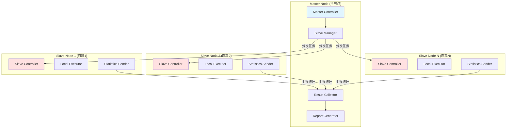
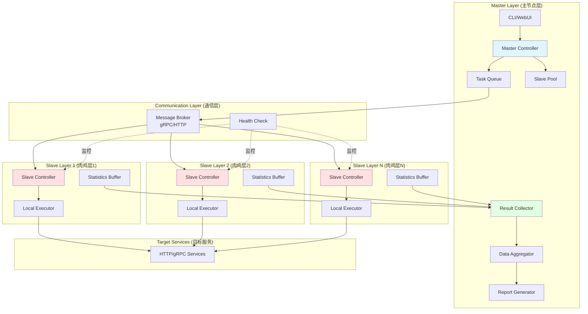
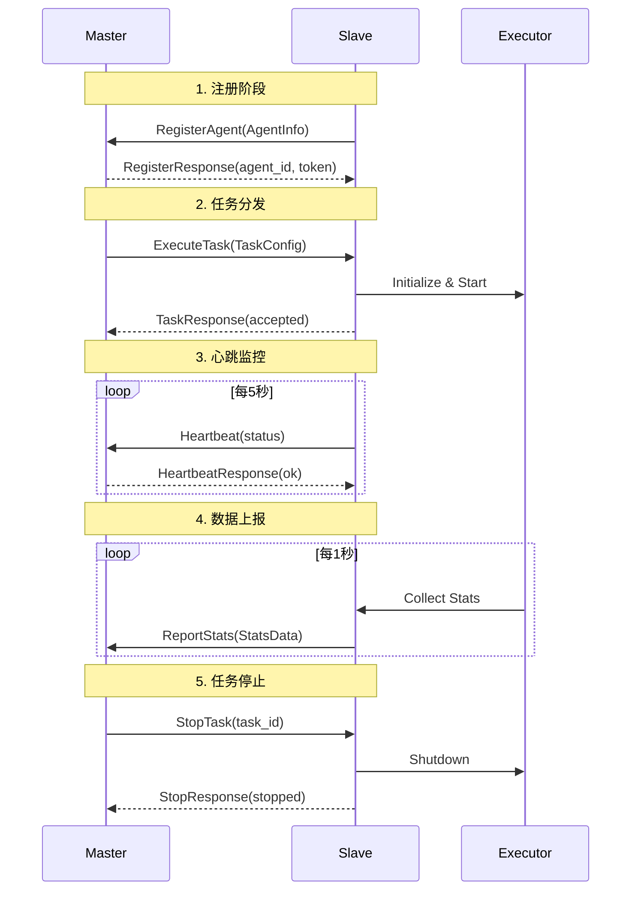
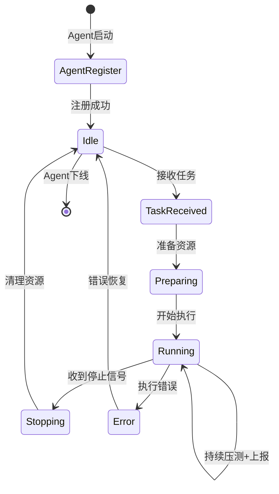

# 🌐 分布式压测架构设计

## 📋 目录

- [架构概述](#-架构概述)
- [核心概念](#-核心概念)
- [系统架构](#-系统架构)
- [通信协议](#-通信协议)
- [数据流转](#-数据流转)
- [实现方案](#-实现方案)

---

## 🎯 架构概述

### 设计目标

- 🚀 **高吞吐量**：支持数万 QPS 的分布式压测能力
- 🔧 **易扩展**：动态添加/移除肉鸡节点
- 📊 **实时汇总**：主节点实时收集并汇总所有节点统计数据
- 🛡️ **高可用**：肉鸡节点故障不影响其他节点运行
- 🎛️ **统一调度**：主节点统一控制所有肉鸡节点的压测任务

### 应用场景

- 超大规模压测（单机压测能力不足）
- 分布式场景模拟（不同地域、网络环境）
- 多目标并发压测
- 长时间稳定性测试

---

## 🏗️ 核心概念

### 角色定义



| 角色 | 职责 | 部署位置 |
|:-----|:-----|:---------|
| **Master (主节点)** | 任务调度、配置分发、结果汇总、报告生成 | 中心服务器 |
| **Slave (肉鸡节点)** | 接收任务、执行压测、上报统计 | 分布式服务器 |

---

## 🏗️ 系统架构

### 整体架构



### 组件详解

#### Master 节点组件

| 组件 | 职责 | 核心功能 |
|:-----|:-----|:---------|
| **Master Controller** | 总控制器 | 任务生命周期管理、Agent 注册管理 |
| **Slave Pool** | Slave 池 | 维护可用 Slave 列表、健康检查 |
| **Task Queue** | 任务队列 | 任务分片、分发策略、失败重试 |
| **Result Collector** | 结果收集器 | 接收 Slave 上报数据、数据缓存 |
| **Data Aggregator** | 数据聚合器 | 实时汇总、统计计算、时间窗口聚合 |
| **Report Generator** | 报告生成器 | 生成最终报告、可视化图表 |

#### Slave 节点组件

| 组件 | 职责 | 核心功能 |
|:-----|:-----|:---------|
| **Slave Controller** | Slave 控制器 | 接收 Master 指令、启动/停止压测 |
| **Local Executor** | 本地执行器 | 执行压测任务（复用现有 Executor） |
| **Statistics Buffer** | 统计缓冲区 | 缓存统计数据、批量上报 |
| **Health Reporter** | 健康上报器 | 上报节点状态、资源使用情况 |

---

## 📡 通信协议

### 协议选型

| 协议 | 场景 | 优势 | 劣势 |
|:-----|:-----|:-----|:-----|
| **gRPC** | 控制指令、实时数据 | 高性能、双向流、强类型 | 实现复杂 |
| **HTTP/REST** | 配置下发、报告查询 | 简单易用、广泛支持 | 性能较低 |
| **WebSocket** | 实时监控、日志流 | 实时双向、持久连接 | 状态维护 |

**推荐方案**：gRPC（主通信） + HTTP（辅助管理）

### gRPC 接口定义

```protobuf
syntax = "proto3";

package stress;

// Master 服务接口
service MasterService {
  // Slave 注册
  rpc RegisterAgent(AgentInfo) returns (RegisterResponse);
  
  // Slave 心跳
  rpc Heartbeat(HeartbeatRequest) returns (HeartbeatResponse);
  
  // 上报统计数据（流式）
  rpc ReportStats(stream StatsData) returns (ReportResponse);
}

// Slave 服务接口
service AgentService {
  // 接收任务
  rpc ExecuteTask(TaskConfig) returns (TaskResponse);
  
  // 停止任务
  rpc StopTask(StopRequest) returns (StopResponse);
  
  // 查询状态
  rpc GetStatus(StatusRequest) returns (AgentStatus);
}

// Slave 信息
message AgentInfo {
  string agent_id = 1;
  string hostname = 2;
  string ip = 3;
  int32 cpu_cores = 4;
  int64 memory = 5;
  string version = 6;
}

// 任务配置
message TaskConfig {
  string task_id = 1;
  string protocol = 2;      // http/grpc
  string target = 3;
  int32 worker_count = 4;
  int32 duration = 5;
  int32 ramp_up = 6;
  bytes config_data = 7;    // JSON 序列化的详细配置
}

// 统计数据
message StatsData {
  string agent_id = 1;
  int64 timestamp = 2;
  int64 total_requests = 3;
  int64 success_count = 4;
  int64 failed_count = 5;
  double avg_latency = 6;
  double p95_latency = 7;
  double p99_latency = 8;
  double qps = 9;
  map<string, int64> status_codes = 10;
}

// Slave 状态
message AgentStatus {
  string agent_id = 1;
  string state = 2;         // idle/running/error
  string current_task_id = 3;
  double cpu_usage = 4;
  double memory_usage = 5;
  int64 running_workers = 6;
}
```

### 消息类型



---

## 🔄 数据流转

### 任务执行流程



### 统计数据聚合

```go
// 统计数据聚合策略
type AggregationStrategy struct {
    WindowSize   time.Duration  // 聚合窗口（如 1s, 5s）
    BufferSize   int            // 缓冲区大小
    FlushPolicy  FlushPolicy    // 刷新策略（时间/大小）
}

// 聚合维度
type AggregationDimension struct {
    ByAgent      bool  // 按 Slave 聚合
    ByAPI        bool  // 按 API 聚合
    ByStatusCode bool  // 按状态码聚合
    ByTimeWindow bool  // 按时间窗口聚合
}

// 聚合结果
type AggregatedStats struct {
    TimeRange    TimeRange              // 时间范围
    TotalAgents  int                    // 参与 Slave 数
    TotalReqs    int64                  // 总请求数
    TotalSuccess int64                  // 总成功数
    TotalFailed  int64                  // 总失败数
    AvgLatency   float64                // 平均延迟
    P95Latency   float64                // P95 延迟
    P99Latency   float64                // P99 延迟
    TotalQPS     float64                // 总 QPS
    ByAgent      map[string]*AgentStats // 各 Slave 统计
    ByAPI        map[string]*APIStats   // 各 API 统计
    StatusCodes  map[int]int64          // 状态码分布
}
```

---

## 💻 实现方案

### 核心数据结构

```go
// Master 节点
type Master struct {
    agentPool    *AgentPool
    taskQueue    *TaskQueue
    collector    *ResultCollector
    aggregator   *DataAggregator
    grpcServer   *grpc.Server
    httpServer   *http.Server
}

// Slave 节点
type Slave struct {
    id           string
    masterAddr   string
    executor     *executor.Executor
    statsBuffer  *StatsBuffer
    grpcClient   MasterServiceClient
    grpcServer   *grpc.Server
    status       AgentStatus
}

// Slave 池
type AgentPool struct {
    mu           sync.RWMutex
    agents       map[string]*AgentInfo
    healthCheck  *HealthChecker
    selector     AgentSelector  // 负载均衡策略
}

// 任务队列
type TaskQueue struct {
    mu           sync.Mutex
    pending      []*Task
    running      map[string]*Task
    splitter     TaskSplitter  // 任务分片策略
}

// 结果收集器
type ResultCollector struct {
    mu           sync.RWMutex
    buffer       chan *StatsData
    cache        *StatsCache
    persistor    StatsPersistor
}

// 数据聚合器
type DataAggregator struct {
    mu           sync.RWMutex
    strategy     AggregationStrategy
    windows      map[string]*TimeWindow
    calculator   StatsCalculator
}
```

### 任务分片策略

```go
// 任务分片器
type TaskSplitter interface {
    Split(task *Task, agentCount int) []*SubTask
}

// 平均分片（默认）
type EqualSplitter struct{}

func (s *EqualSplitter) Split(task *Task, agentCount int) []*SubTask {
    workersPerAgent := task.WorkerCount / agentCount
    remainder := task.WorkerCount % agentCount
    
    subTasks := make([]*SubTask, agentCount)
    for i := 0; i < agentCount; i++ {
        subTasks[i] = &SubTask{
            TaskID:      fmt.Sprintf("%s-part-%d", task.ID, i),
            WorkerCount: workersPerAgent,
            Config:      task.Config,
        }
        // 将余数分配给前面的 Slave
        if i < remainder {
            subTasks[i].WorkerCount++
        }
    }
    return subTasks
}

// 权重分片（根据 Slave 能力）
type WeightedSplitter struct {
    weights map[string]float64  // agent_id -> weight
}

func (s *WeightedSplitter) Split(task *Task, agents []*AgentInfo) []*SubTask {
    totalWeight := 0.0
    for _, slave := range agents {
        totalWeight += s.getWeight(slave)
    }
    
    subTasks := make([]*SubTask, len(agents))
    for i, slave := range agents {
        weight := s.getWeight(slave)
        workerCount := int(float64(task.WorkerCount) * weight / totalWeight)
        subTasks[i] = &SubTask{
            TaskID:      fmt.Sprintf("%s-%s", task.ID, slave.ID),
            SlaveID:     slave.ID,
            WorkerCount: workerCount,
            Config:      task.Config,
        }
    }
    return subTasks
}

func (s *WeightedSplitter) getWeight(slave *AgentInfo) float64 {
    if w, ok := s.weights[slave.ID]; ok {
        return w
    }
    // 默认按 CPU 核心数
    return float64(slave.CPUCores)
}
```

### Slave 选择策略

```go
// Slave 选择器
type AgentSelector interface {
    Select(agents []*AgentInfo, count int) []*AgentInfo
}

// 随机选择
type RandomSelector struct{}

func (s *RandomSelector) Select(agents []*AgentInfo, count int) []*AgentInfo {
    if count >= len(agents) {
        return agents
    }
    
    rand.Shuffle(len(agents), func(i, j int) {
        agents[i], agents[j] = agents[j], agents[i]
    })
    return agents[:count]
}

// 负载最低选择
type LeastLoadedSelector struct{}

func (s *LeastLoadedSelector) Select(agents []*AgentInfo, count int) []*AgentInfo {
    sort.Slice(agents, func(i, j int) bool {
        return agents[i].CurrentLoad < agents[j].CurrentLoad
    })
    
    if count >= len(agents) {
        return agents
    }
    return agents[:count]
}

// 地域感知选择
type LocationAwareSelector struct {
    preferredRegions []string
}

func (s *LocationAwareSelector) Select(agents []*AgentInfo, count int) []*AgentInfo {
    preferred := make([]*AgentInfo, 0)
    others := make([]*AgentInfo, 0)
    
    for _, slave := range agents {
        if s.isPreferred(slave.Region) {
            preferred = append(preferred, slave)
        } else {
            others = append(others, slave)
        }
    }
    
    result := make([]*AgentInfo, 0, count)
    result = append(result, preferred...)
    if len(result) < count {
        result = append(result, others[:count-len(result)]...)
    }
    return result[:count]
}
```

### 健康检查机制

```go
// 健康检查器
type HealthChecker struct {
    pool         *AgentPool
    interval     time.Duration
    timeout      time.Duration
    maxFailures  int
    failureCount map[string]int
}

func (hc *HealthChecker) Start(ctx context.Context) {
    ticker := time.NewTicker(hc.interval)
    defer ticker.Stop()
    
    for {
        select {
        case <-ctx.Done():
            return
        case <-ticker.C:
            hc.checkAll()
        }
    }
}

func (hc *HealthChecker) checkAll() {
    agents := hc.pool.GetAllAgents()
    
    for _, slave := range agents {
        go func(a *AgentInfo) {
            if err := hc.checkAgent(a); err != nil {
                hc.handleFailure(a)
            } else {
                hc.handleSuccess(a)
            }
        }(slave)
    }
}

func (hc *HealthChecker) checkAgent(slave *AgentInfo) error {
    ctx, cancel := context.WithTimeout(context.Background(), hc.timeout)
    defer cancel()
    
    client := hc.getGRPCClient(slave)
    _, err := client.Heartbeat(ctx, &HeartbeatRequest{
        SlaveID:   slave.ID,
        Timestamp: time.Now().Unix(),
    })
    return err
}

func (hc *HealthChecker) handleFailure(slave *AgentInfo) {
    hc.failureCount[slave.ID]++
    
    if hc.failureCount[slave.ID] >= hc.maxFailures {
        // 标记 Slave 为不可用
        hc.pool.MarkUnhealthy(slave.ID)
        logger.Warn("Slave marked as unhealthy",
            "agent_id", slave.ID,
            "failures", hc.failureCount[slave.ID])
    }
}

func (hc *HealthChecker) handleSuccess(slave *AgentInfo) {
    // 重置失败计数
    hc.failureCount[slave.ID] = 0
    hc.pool.MarkHealthy(slave.ID)
}
```

### 统计数据上报

```go
// 统计缓冲区
type StatsBuffer struct {
    mu           sync.Mutex
    slaveID      string
    buffer       []*statistics.Record
    maxSize      int
    flushTicker  *time.Ticker
    client       MasterServiceClient
}

func (sb *StatsBuffer) Add(record *statistics.Record) {
    sb.mu.Lock()
    defer sb.mu.Unlock()
    
    sb.buffer = append(sb.buffer, record)
    
    // 缓冲区满时立即刷新
    if len(sb.buffer) >= sb.maxSize {
        go sb.Flush()
    }
}

func (sb *StatsBuffer) Start(ctx context.Context) {
    sb.flushTicker = time.NewTicker(1 * time.Second)
    defer sb.flushTicker.Stop()
    
    for {
        select {
        case <-ctx.Done():
            sb.Flush() // 最后刷新一次
            return
        case <-sb.flushTicker.C:
            sb.Flush()
        }
    }
}

func (sb *StatsBuffer) Flush() error {
    sb.mu.Lock()
    if len(sb.buffer) == 0 {
        sb.mu.Unlock()
        return nil
    }
    
    // 复制并清空缓冲区
    toSend := make([]*statistics.Record, len(sb.buffer))
    copy(toSend, sb.buffer)
    sb.buffer = sb.buffer[:0]
    sb.mu.Unlock()
    
    // 聚合数据
    statsData := sb.aggregate(toSend)
    
    // 发送到 Master
    ctx, cancel := context.WithTimeout(context.Background(), 5*time.Second)
    defer cancel()
    
    stream, err := sb.client.ReportStats(ctx)
    if err != nil {
        return err
    }
    
    return stream.Send(statsData)
}

func (sb *StatsBuffer) aggregate(records []*statistics.Record) *StatsData {
    data := &StatsData{
        SlaveID:   sb.slaveID,
        Timestamp: time.Now().Unix(),
    }
    
    latencies := make([]float64, 0, len(records))
    statusCodes := make(map[string]int64)
    
    for _, r := range records {
        data.TotalRequests++
        if r.Success {
            data.SuccessCount++
        } else {
            data.FailedCount++
        }
        latencies = append(latencies, r.Latency)
        statusCodes[fmt.Sprintf("%d", r.StatusCode)]++
    }
    
    // 计算延迟百分位
    sort.Float64s(latencies)
    if len(latencies) > 0 {
        data.AvgLatency = mathx.Average(latencies)
        data.P95Latency = mathx.Percentile(latencies, 95)
        data.P99Latency = mathx.Percentile(latencies, 99)
    }
    
    data.StatusCodes = statusCodes
    data.Qps = float64(data.TotalRequests) / 1.0 // 1秒窗口
    
    return data
}
```

---

## 🎯 使用示例

### Master 启动

```bash
# 启动 Master 节点
go-stress master start \
  --grpc-port 50051 \
  --http-port 8080 \
  --log-level info
```

### Slave 启动

```bash
# 在各个肉鸡机器上启动 Slave
go-stress slave start \
  --master-addr 192.168.1.100:50051 \
  --slave-id slave-001 \
  --grpc-port 50052
```

### 提交分布式任务

```bash
# 提交分布式压测任务
go-stress run distributed \
  --config test.yaml \
  --agents 10 \          # 使用 10 个 Slave
  --duration 60s \
  --workers-per-slave 100
```

### 配置文件示例

```yaml
# distributed-test.yaml
distributed:
  master_addr: "192.168.1.100:50051"
  agent_count: 5
  agent_selector: "least_loaded"  # random/least_loaded/location_aware
  task_splitter: "weighted"       # equal/weighted
  
stress:
  protocol: http
  target: "https://api.example.com"
  duration: 300s
  ramp_up: 60s
  
  # 每个 Slave 的配置
  per_agent:
    worker_count: 100
    connection_pool: 50
  
  # 统计上报配置
  stats:
    report_interval: 1s
    buffer_size: 1000
    aggregation_window: 5s
```

---

## 📊 监控与可视化

### 实时监控面板

```
┌─ Distributed Stress Test Dashboard ─────────────────────────────────┐
│                                                                      │
│  Master: 192.168.1.100:50051                    Status: ● Running   │
│  Task ID: dist-test-20260123                    Duration: 02:45/300s│
│                                                                      │
├─ Slave Status ──────────────────────────────────────────────────────┤
│  Total: 5   Online: 5   Running: 5   Idle: 0   Error: 0            │
│                                                                      │
│  Slave ID      IP              Workers  QPS     Latency  Status     │
│  ─────────────────────────────────────────────────────────────────  │
│  slave-001     192.168.1.101   100     1,250    45ms    ● Running  │
│  slave-002     192.168.1.102   100     1,180    48ms    ● Running  │
│  slave-003     192.168.1.103   150     1,890    42ms    ● Running  │
│  slave-004     192.168.1.104   100     1,220    50ms    ● Running  │
│  slave-005     192.168.1.105   100     1,210    46ms    ● Running  │
│                                                                      │
├─ Aggregated Statistics ─────────────────────────────────────────────┤
│  Total Requests: 982,450              Success Rate: 99.8%           │
│  Total QPS: 6,750                     Failed: 1,965                 │
│  Avg Latency: 46.2ms                  P95: 85ms    P99: 120ms      │
│                                                                      │
│  Status Codes:  200: 98.5%   201: 0.8%   400: 0.3%   500: 0.4%     │
│                                                                      │
└──────────────────────────────────────────────────────────────────────┘
```

---

## 🔒 安全机制

### 认证授权

```go
// Token 认证
type TokenAuth struct {
    secret string
    tokens map[string]*TokenInfo
}

func (ta *TokenAuth) GenerateToken(slaveID string) (string, error) {
    token := jwt.NewWithClaims(jwt.SigningMethodHS256, jwt.MapClaims{
        "agent_id": slaveID,
        "exp":      time.Now().Add(24 * time.Hour).Unix(),
    })
    return token.SignedString([]byte(ta.secret))
}

func (ta *TokenAuth) ValidateToken(tokenString string) (*TokenInfo, error) {
    token, err := jwt.Parse(tokenString, func(token *jwt.Token) (interface{}, error) {
        return []byte(ta.secret), nil
    })
    
    if err != nil || !token.Valid {
        return nil, errors.New("invalid token")
    }
    
    claims := token.Claims.(jwt.MapClaims)
    return &TokenInfo{
        SlaveID: claims["agent_id"].(string),
    }, nil
}
```

### TLS 加密

```go
// TLS 配置
func NewTLSConfig() (*tls.Config, error) {
    cert, err := tls.LoadX509KeyPair("server.crt", "server.key")
    if err != nil {
        return nil, err
    }
    
    return &tls.Config{
        Certificates: []tls.Certificate{cert},
        MinVersion:   tls.VersionTLS12,
    }, nil
}
```

---

## 🚀 扩展性

### 动态扩容

- 支持运行时添加 Slave
- 任务自动重新分片
- 平滑迁移正在运行的任务

### 故障恢复

- Slave 故障自动检测
- 任务自动重新分配
- 统计数据补偿机制

### 性能优化

- 批量数据上报
- 连接池复用
- 异步非阻塞 I/O
- 数据压缩传输

---

## 📝 总结

分布式压测架构通过 Master-Slave 模式，实现了：

1. ✅ **水平扩展**：通过增加肉鸡节点提升压测能力
2. ✅ **统一调度**：Master 统一控制和监控所有节点
3. ✅ **实时汇总**：秒级数据聚合和展示
4. ✅ **高可用**：节点故障自动恢复和任务迁移
5. ✅ **易于运维**：简单的部署和配置方式

该架构可支持 **数万 QPS** 的分布式压测能力,满足大规模性能测试需求。
